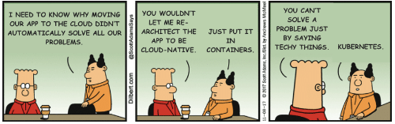

# Agenda

- Contexto
- ¿Qué es Kubernetes?
- Arquitectura de Kubernetes
- Algunos Recursos del API
- Algunos Comandos
- Siguientes Pasos

# Contexto

## Objetivos

- Entender beneficios de usar Kubernetes
- Conocer su arquitectura
- Conocer recursos más relevantes
- Saber qué pasos seguir para empezar

::: notes

- Conocer un pocode k8s
- Usar un poco kubernetes: minikube
- Ser conscientes de que k8s no es para todas las aplicaciones
  - microservicios que se comunican por APIs REST

:::

## Escenarios Diferentes


## Procesos de DevOps

- Despliegues - Rollbacks
- Administración de Estado Distribuido
- Aprovisionamiento de Ambientes
  - Dev - Pruebas - Carga - Seguridad
- Escalabilidad
- Monitoreo
- Lógica de Autocuración
- Seguridad
- Administración de la Configuración
- ... como código o documentado

::: notes

necesitamos concentrarnos más en procesos y menos en tecnologías

:::

# ¿Qué es Kubernetes?



## Abstracciones

> The essence of abstractions is preserving information that is relevant in a given context, and forgetting information that is irrelevant in that context.
>
> – John V. Guttag

- interfaces de programación - APIs
- Sistema Operativo - Docker

::: notes

Docker es una abstracción

restringido a correrlo en una única máquina

intentos: docker swarm, machine, compose

:::

## Kubernetes


- ***Plataforma de administración de aplicaciones y servicios "containerizados" (OCI)***
  - **código abierto**
  - **configuración declarativa** de estado y comportamiento
  - facilita instalación y monitoreo de **aplicaciones distribuidas**

::: notes

Open Container Iniciative

- runtime specification
- image specification

:::

## Beneficios

- velocidad
- escalabilidad
- abstracción de infraestructura
- eficiencia

::: notes

Velocidad

Alto número de features + mantener una alta disponibilidad de los servicios

- Inmutabilidad
- Configuración Declarativa
- Sistemas de autocuración online
- Instalación de aplicaciones (HELM)

Escalabilidad (software y equipo)

- Desacoplamiento de Arquitecturas
  - desacoplando aplicaciones: load balancers for each
  - desacoplando recursos de k8s: pods, namespaces, services, ingresses
  
- KaaS
  - gcp - aws
  - Tectonic + Openshit
  - Rancher
  - Digital Ocean

Abstracción de Infraestructura

- Separar desarrolladores de las máquinas
- Portabilidad
  - los mismos manifiestos funcionan en cualquier cluster de K8s
  - intentar evitar servicios de la nube que lo amarren a esta

Eficiencia

- Facilita encontrar el número óptimo de nodos usado al mismo tiempo por varios equipos

:::

## Provee

- "Descubrimiento" de Servicios y Balanceo de Carga
- Interfaces de Almacenamiento
- Despliegues y Reversiones automáticas
- Asignación automatizada de trabajo a nodos
- Lógica de Auto Curación
- Administración de Configuración y Secretos

::: notes

creo que a medida que k8s evolucione va a cubrir más y más los procesos de devops

¿Qué cosas no hace K8s?

- No limita el tipo de aplicación
- No provee servicios de nivel de aplicación
  - buses, bases de datos, cachés
- No obliga a usar tecnologías específicas de monitoreo, logging o alerta
- No provee sistemas de configuración de máquinas, mantenimiento, administración o de auto curación.
- No obtiene código fuente ni construye aplicaciones
  - aunque tecnologías como Tekton lo permiten

- No obliga a usar un lenguaje específico
- No es un sistema de orquestración pues no tiene centro de control

:::

# Arquitectura de Kubernetes

## Ejemplo de Usuarios y Procesos

- **operadores**
  - instalación
  - mantenimiento (100s) de cluster(s)
  - configuración de clusters
    - redes - almacenamiento
- **usuarios del API de k8s** (desarrolladores, qa)
  - creación de recursos de k8s
- **usuarios finales**

::: notes

los operadores idealmente conocen las entrañas de k8s

usuarios finales ni saben que interactúan con kubernetes: pokemon go

:::

## Componentes


::: notes

CONCEPTOS: cluster, nodo

RECURSO del API: pod

Cuando despliegan k8s obtienen un cluster

Un cluster es un conjunto de máquinas llamadas **nodos**, que corren aplicaciones containerizadas y que son administradas por k8s.

Un cluster tiene por lo menos un nodo trabajador y un nodo maestro.

Los nodos trabajadores abergan los **pods** que son los componentes de la aplicación.

Los nodos maestro administran

- los nodos trabajadores
- los pods en el cluster

Con múltiples nodos maestros se consigue conmutación por error y alta disponibilidad del cluster.

:::

## Responsabilidades del Nodo Maestro

- Decisiones globales del cluster
- Detectan y responden a eventos del cluster
- Sus componentes pueden arrancar en cualquier nodo

::: notes

- scripts por defecto
  - los arrancan en el mismo nodo
  - impiden ejecución de pods de usuarios

:::

## Componentes del Nodo Maestro

- kube api server
- etcd
- kube scheduler
- kube controller manager
- cloud manager

::: notes

- kube api server
- etcd
- kube scheduler
- kube controller manager
- cloud manager

:::

## Componentes de los Nodos Trabajadores

- kubelet
- kube proxy
- container runtime

::: notes

kubelet

kube proxy

- Enruta el tráfico de red hacia servicios con balanceadores de carga en el cluster
- Presente en cada nodo del cluster
  - Usualmente corre como un **DaemonSet**

Container Runtime

- asd

:::

## Componentes adicionales

- DNS
- web ui
- container resource monitoring
- cluster level logging

::: notes

DNS

- Provee nombramiento y descubrimiento de los servicios definidos en el cluster
- Dependiendo del tamaño del cluster se pueden encontrar uno o más corriendo
  - Usualmente corre como un **Deployment**
  - Usa un **Service** para balancear la carga entre las instancias del servidor de DNS
- La ip del **Service** se encuentra en el archivo `/etc/resolv.conf` de cada contenedor que se ejecuta en el cluster

Web UI

- Corre una única replica de **Deployment** y usa un **Service** para estar disponible desde el cluster
- Puede ser accedido usando `$ kubectl proxy`
- No siempre se instala

Container Resource Monitoring

Cluster Level Logging

:::

# Algunos Recursos del API

---


------


------


---


---


---


---


---


---


---


# Algunos Comandos

## Instalar Kubernetes

### Proveedor de Nube

#### GCP

```bash
$ gcloud config set compute/zone us-west1-a
$ gcloud container clusters create s4n-cluster
$ gcloud auth application-default login
```

#### Azure

```bash
$ az group create --name=s4n --location=westus
$ az aks create --resource-group=s4n --name=s4n-cluster
$ az aks get-credentials --resource-group=s4n --name=s4n-cluster
```

#### AWS

```bash
$ eksctl create cluster --name s4n ...
```

#### Digital Ocean

```bash
$ doctl kubernetes cluster list
$ doctl kubernetes cluster kubeconfig save s4n
$ kubectl get nodes
```

### Máquina local

#### minikube

Asegúrese de instalar un hypervisor como **virtualbox** o **kvm**.

```bash
$ minikube start
$ minikube stop
$ minikube delete
```

#### kind

Kubernetes in Docker

```bash
$ kind create cluster --wait 5min
$ export KUBECONFIG="$(kind get kubeconfig-path)"
$ kubectl cluster-info
$ kind delete cluster
```

### Máquinas on premise

#### k3s de Rancher

```bash
# On Server
$ curl -sfL https://get.k3s.io | sh -
$ sudo k3s server &
# Kubeconfig is written to /etc/rancher/k3s/k3s.yaml
$ sudo k3s kubectl get nodes

# On Nodes
$ curl -sfL https://get.k3s.io | K3S_URL=https://myserver:6443 K3S_TOKEN=XXX sh -
# On a different node run the below. NODE_TOKEN comes from 
# /var/lib/rancher/k3s/server/node-token on your server
$ sudo k3s agent --server https://myserver:6443 --token ${NODE_TOKEN}
```

#### Ansible

- [Kubernetes setup using ansible and vagrant](https://kubernetes.io/blog/2019/03/15/kubernetes-setup-using-ansible-and-vagrant/)
- [Ansible Galaxy](https://galaxy.ansible.com/geerlingguy/kubernetes)
- [Openshift](https://github.com/openshift/openshift-ansible)

## Cliente de Kubernetes

```bash
$ kubectl version
$ kubectl get componentstatuses
$ kubectl get nodes
$ kubectl describe nodes node-1
```

::: notes

Versiones

- Mantenerse entre dos versiones menores de distancia
- No usar nuevas características en clusters viejos

Describe nodes

- muestra información sobre
  - nodo
    - Os running
    - architecture
    - hostname
  - operación
    - Disk usage
    - Memory Usage
  - capacidad
    - Total Memory
    - Total CPU
    - GPU info
    - Pods
  - Pods que corren actualmente

:::

## Namespaces

- Organiza objetos en el cluster (como carpetas)
  - si no se configura **kubectl** este interactúa por defecto con el namespace **defaut**

```bash
$ kubectl -n anothernamespace get pods
$ kubectl --all-namespaces get pods
```

## Contexts

- Cluster o Namespace

- `$HOME/.kube/config`


```bash
$ kubectl config set-context my-context --namespace=my-namespace
$ kubectl config use-context my-context
```

- algunos comandos externos actualizan el archivo `$HOME/.kube/config`. ¡SEA CONSCIENTE DE ELLO!

::: notes

- helm
- ranchercli
- gcloud
- doctl
- minikube
- az
- eksctl

:::

## Interactuar con Objetos del API de Kubernetes

### Describir Objetos del API

```bash
$ kubectl get pods my-pod -o jsonpath --template={.status.podIP}
$ kubectl describe <resource-name> <obj-name>
```

### Crear, Actualizar y Destruir Objetos de K8s

```bash
$ kubectl apply -f obj.yaml
$ vi obj.yaml # update some resources
$ kubectl apply --dry-run -f obj.yaml # output the changes without making them
$ kubectl apply -f obj.yaml
$ kubectl edit <resource-name> <obj-name> # after saving it is automatically updated
$ kubectl delete -f obj.yaml
$ kubectl delete <resource-name> <obj-name>
```

### Comandos de Debugging

```bash
$ kubectl top nodes
$ kubectl logs <pod-name>
$ kubectl exec -ti exec <pod-name> -- bash
$ kubectl attach -it <pod-name>
$ kubectl cp <pod-name>:</path/to/remote/file> </path/to/local/file>
$ kubectl port-forward <pod-name> 8080:80
```

- Se puede hacer port forwarding también con servicios
  - pero las peticiones siempre se envían al mismo Pod aunque hayan varios detrás

### kubectl help

```bash
$ kubectl help
$ kubectl help | grep kubeconfig
$ kubectl help | less
```

# Siguientes Pasos

## Role Based Access Control (RBAC)

- acceso granular al API de K8s para usuarios y **service accounts**

## K8s Storage Solutions

- Best practices
- StatefulSets
- Ceph

## Extending Kubernetes

- CRDs
- CNI
- plugins

## HELM

- Why?
- What?
- Usage

## Kubernetes as a Service

- gcp
- aws
- azure
- digital ocean
- tectonic + Open Shift
- rancher
- costs comparison

## Kubernetes Ingresses Controllers

- nginx
- kong
- gloo
- istio
- skipper
- traefik
- ...

## CD Pipelines

- Jenkins X
- Spinnaker
- Tekton

## Managing Secrets and Configurations

- consul integration
- vault integration

## Cloud Native Groups

- CNCF

- CDF

# Bibliografía y Recursos

## Bibliografía

- *Kubernetes: Up and running*, 2nd edition, by Brendan Burns, Joe Beda and Kelsey Hightower (O'Reilly).

## Recursos

- [Kubernetes API Reference Documentation](https://kubernetes.io/docs/reference/)
- [The Illustrated Children's Guide to Kubernetes](https://www.youtube.com/watch?v=4ht22ReBjno)
- [A Kubernetes story: Phippy goes to the zoo](https://www.youtube.com/watch?v=R9-SOzep73w)
- [CNCF: A Kubernetes story](https://www.cncf.io/phippy-goes-to-the-zoo-book/)
- [CNCF: The Illustrated Children's Guide to Kubernetes](https://www.cncf.io/the-childrens-illustrated-guide-to-kubernetes/)
- [Kubernetes.io](https://kubernetes.io/docs/concepts/overview/what-is-kubernetes/)
- [OCI](https://www.opencontainers.org/)
- [Bringing Pokemon GO to life on gcp](https://cloud.google.com/blog/products/gcp/bringing-pokemon-go-to-life-on-google-cloud)
