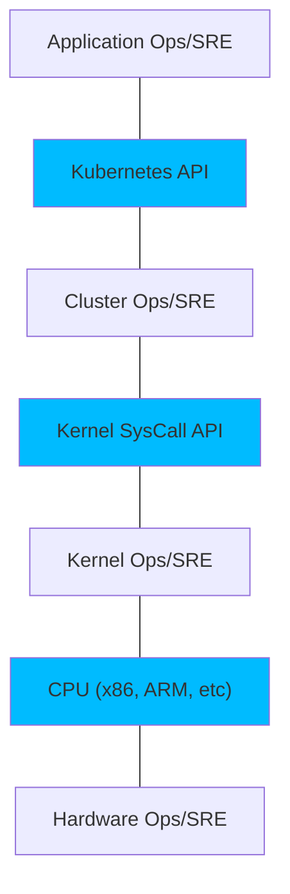

# Distributed Applications

## Processes

- Deployments
- Rollbacks
- Distributed State Management
- Testing
- Scaling
- Monitoring
- Self Healing Logic
- Environment Provisioning
- Security
- Configuration Management

## Different scenarios

- Microservices running as Services (Windows Services, init.d, upstart, systemctl)
  - Physical Machines
  - Virtual Machines
- Containerized applications (Docker)

# Kubernetes

- Open Source Orchestrator for deploying containerized applications

## Benefits

### Velocity

High number of features + maintaining a highly available service.

- Immutability
- Declarative Configuration
- Online self-healing systems

### Scaling (software and teams)

- Decoupling Architectures
  - decoupling applications: load balancers for each
  - decoupling teams and infrastructure
  - decoupling k8s resources: pods, namespaces, services, ingresses
- Separation of Concerns for Consistency and Scaling
  - Application Developer relies on Service Level Agreements.
  - Container Orchestration API Reliability Engineer focuses on delivering the orchestration API's SLA without worrying about the applications that are running on top of it.
  - OS Reliability Engineers focus on the SLA of the individual machine's OS.

### Scaling



- KaaS

### Infrastructure abstraction

- Separate developers from machines
- Portability
  - same manifests work on any K8s cluster
  - avoid cloud managed services

### Efficiency

- Optimal number of nodes used at the same time for various teams

## Deploying a Cluster

### Public Cloud Provider

#### GCP

```bash
$ gcloud config set compute/zone us-west1-a
$ gcloud container clusters create s4n-cluster
$ gcloud auth application-default login
```

#### Azure

```bash
$ az group create --name=s4n --location=westus
$ az aks create --resource-group=s4n --name=s4n-cluster
$ az aks get-credentials --resource-group=s4n --name=s4n-cluster
```

#### AWS

```bash
$ eksctl create cluster --name s4n ...
```

### Locally

#### minikube

Make sure you install an hypervisor such as **virtualbox** or **kvm**.

```bash
$ minikube start
```

```bash
$ minikube stop
```

```bash
$ minikube delete
```

#### kind

Kubernetes in Docker

```bash
$ kind create cluster --wait 5min
$ export KUBECONFIG="$(kind get kubeconfig-path)"
$ kubectl cluster-info
$ kind delete cluster
```

## Kubernetes Client

### Versions

```bash
$ kubectl version
```

- Stay within two minor versions
- Don't try to use newer features on an older cluster

### Component Statuses

```bash
$ kubectl get componentstatuses
```

- **controller manager**: controllers regulate behavior of the cluster
- **scheduler**: places different pods onto different nodes in the cluster
- **etcd**: storage for the cluster  where all API objects are stored

### Worker Nodes

```bash
$ kubectl get nodes
```

- **master nodes**: where the core cluster containers run
  - API server
  - Scheduler
- **worker nodes**: where users containers run

```bash
$ kubectl describe nodes node-1
```

- shows information about
  - Node
    - Os running
    - architecture
    - hostname
  - Operation
    - Disk usage
    - Memory Usage
  - Capacity
    - Total Memory
    - Total CPU
    - GPU info
    - Pods
  - Current running pods

## Cluster Components

The following components run in the **kube-system** namespace.

### Kubernetes Proxy

- Routes network traffic to load balanced services in the Kubernetes Cluster
- Present on every node in the cluster
  - Usually runs as a **DaemonSet**

### Kubernetes DNS

- Provides naming and discovery for the services that are defined in the cluster
- Depending on the size of the cluster you may find one or more DNS servers running in your cluster
  - Usually runs as a **Deployment**
  - Uses a **Service** to do load balancing between the DNS server instances
- You will find the **Service** ip in the `/etc/resolv.conf` file on each container running in the cluster

### Kubernetes UI

- Runs as single replica **Deployment** and uses a **Service** to be available from the cluster
- Can be accessed using `$ kubectl proxy`
- Not always installed

## Basic Kubernetes Resources / API Objects

### Namespaces

- Organize objects in the cluster (like a folder)
  - a non configured **kubectl** interacts with the **defaut** namespace

```bash
$ kubectl -n anothernamespace get pods
$ kubectl --all-namespaces get pods
```

### Contexts

- Each context is a different K8s cluster or K8s cluster namespace

- List of contexts and their configuration is stored in `$HOME/.kube/config` file

- You can list, create, update and delete the contexts in two ways:

  - by directly updating the `$HOME/.kube/config` file
  - by executing kubectl

  ```bash
  $ kubectl config set-context my-context --namespace=my-namespace
  $ kubectl config use-context my-context
  ```

  - some external commands update the `$HOME/.kube/config` file. BE AWARE of that!
    - helm
    - ranchercli
    - gcloud

### Services

### Pods

### Ingress

### ReplicaSets

### Deployments

### DaemonSets

### Jobs

### ConfigMaps

### Secrets

## Interacting with Kubernetes API Objects

### Describe API Objects

```bash
$ kubectl get pods my-pod -o jsonpath --template={.status.podIP}
$ kubectl describe <resource-name> <obj-name>
```

### Create, Update and Destroy K8s Objects

```bash
$ kubectl apply -f obj.yaml
$ vi obj.yaml # update some resources
$ kubectl apply --dry-run -f obj.yaml # output the changes without making them
$ kubectl apply -f obj.yaml
$ kubectl edit <resource-name> <obj-name> # after saving it is automatically updated
$ kubectl delete -f obj.yaml
$ kubectl delete <resource-name> <obj-name>
```

### Labeling and Annotating Objects

```bash
$ kubectl label pods checkin project=airline
$ kubectl label pods checkin project=airline2 --overwrite
$ kubectl label pods checkin project- # delete the label
```

```bash
$ kubectl annotate pods checkin project=airline
$ kubectl annotate pods checkin project=airline2 --overwrite
$ kubectl annotate pods checkin project- # delete the annotation
```

### Debugging Commands

```bash
$ kubectl top nodes
$ kubectl logs <pod-name>
$ kubectl exec -ti exec <pod-name> -- bash
$ kubectl attach -it <pod-name>
$ kubectl cp <pod-name>:</path/to/remote/file> </path/to/local/file>
$ kubectl port-forward <pod-name> 8080:80
```

- Port forwarding can be done with services too.
  - But the requests are forwarded to a single Pod in that service

### kubectl help

```bash
$ kubectl help
$ kubectl help | grep kubeconfig
$ kubectl help | less
```

# Cloud Native Groups

## CNCF

## CDF

# Advanced K8s Topics

## Role Based Access Control (RBAC)

- granular access to the K8s API for users and **service accounts**

## K8s Storage Solutions

- Best practices
- StatefulSets
- Ceph

## Extending Kubernetes

- CRDs
- CNI
- plugins

## HELM

- Why?
- What?
- Usage

## Kubernetes as a Service

- gcp
- aws
- azure
- digital ocean
- costs comparison

## Kubernetes Ingresses Controllers

- Nginx
- Kong
- Ambassador (API Gateway based on Envoy)
- Voyager (HaProxy)
- AWS ALB Ingress controller
- Contour (Envoy)
- Citrix
- F5
- Gloo
- HaProxy
- Istio (Envoy)
- Skipper
- Traefik

## CD Pipelines

- Jenkins X
- Spinnaker
- Tekton

# Bibliography

- *Kubernetes: Up and running*, 2nd edition, by Brendan Burns, Joe Beda and Kelsey Hightower (O'Reilly).
- [Kubernetes API Reference Documentation](https://kubernetes.io/docs/reference/)
